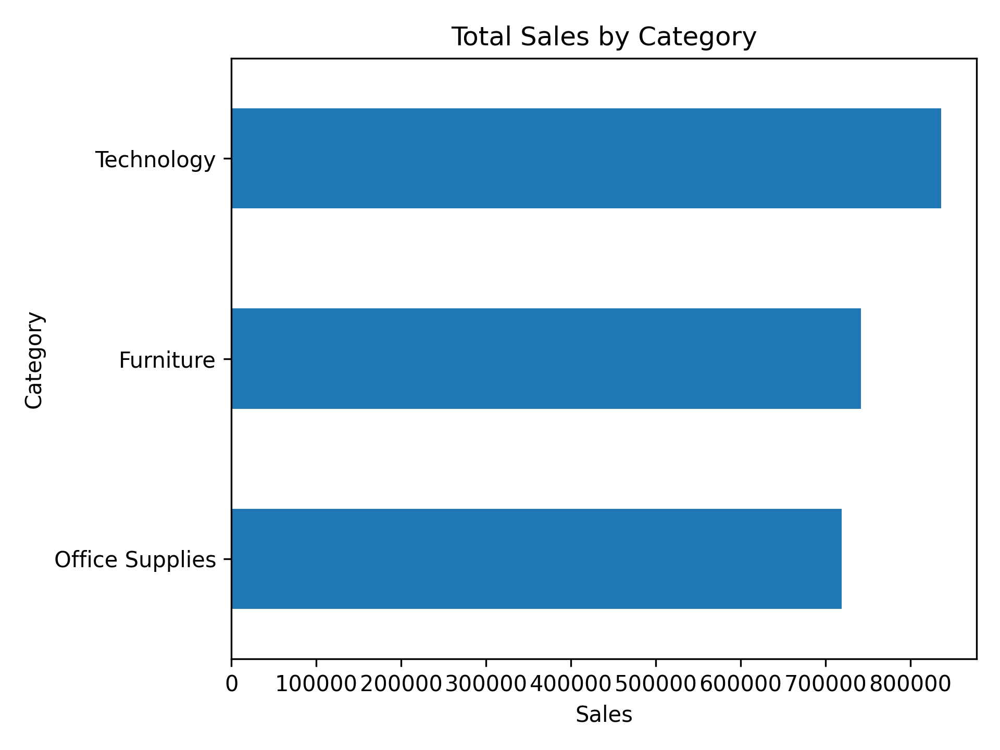
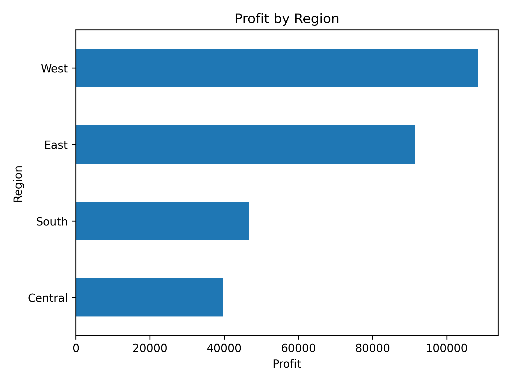
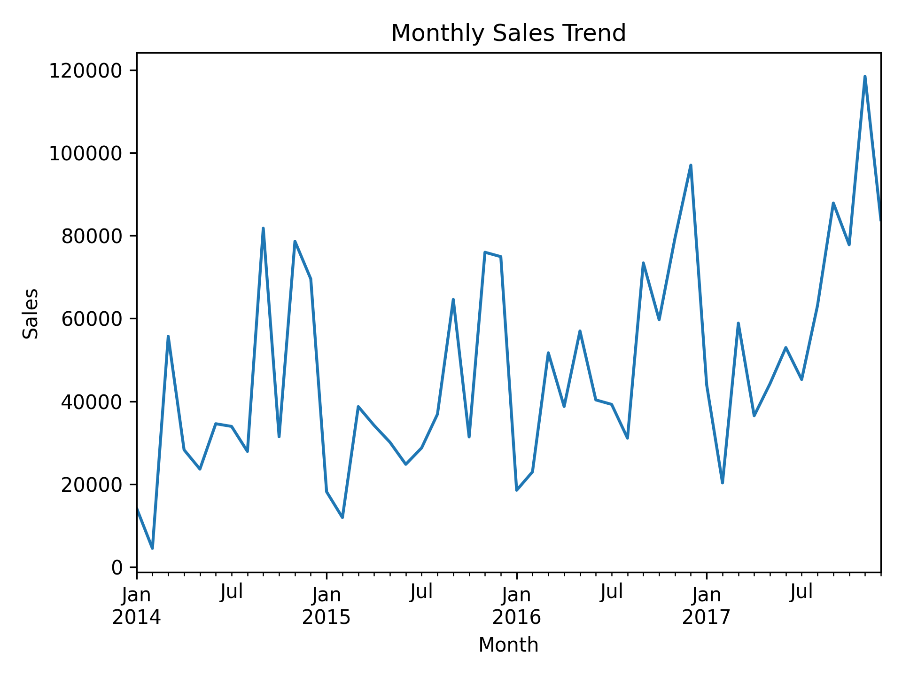

# Sales Data Analysis Dashboard

This project analyzes sales data and builds a dashboard to identify key business insights.

Tools Used:
- Python
- Pandas
- Power BI

## Visual Insights

### Sales by Category

### Profit by Region

### Monthly Sales Trend

